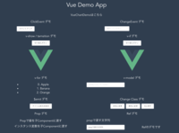

# vue-demo-sample

Vue.jsで出来ることの簡単なデモサンプルプロジェクトです。

## 前提事項
- nodeバージョン:10.21.0
- yarnがインストール済みであること
- gitがインストールされていること

## 動かし方
- 自分のPCの任意の場所にGithubからリポジトリをCloneする
  ```
  git clone https://github.com/IoTkyoto/vue-demo-sample.git
  ```
- ターミナルでダウンロードしたディレクトリに移動する
  ```
  cd vue-demo-sample
  ```
- 必要なライブラリをインストールする
  ```
  yarn install
  ```
- 開発サーバーを立ち上げる
  ```
  yarn serve
  ```
- ターミナルに表示されたURLにアクセスする
  ```
  App running at:
  - Local:   http://localhost:8080/ 
  ```


## デモ内容説明
以下の各デモはコンポーネントとして作成されています。
- ClickEvent デモ
- ChangeEvent デモ
- v-show / tarnsition デモ
- v-if デモ
- v-for デモ
- v-model デモ
- $emit デモ
- Change Class デモ
- Prop デモ
- Ref デモ

## Project setup
```
yarn install
```

### Compiles and hot-reloads for development
```
yarn run serve
```

### Compiles and minifies for production
```
yarn run build
```

### Run your tests
```
yarn run test
```

### Lints and fixes files
```
yarn run lint
```

### Run your end-to-end tests
```
yarn run test:e2e
```

### Run your unit tests
```
yarn run test:unit
```

### Customize configuration
See [Configuration Reference](https://cli.vuejs.org/config/).
